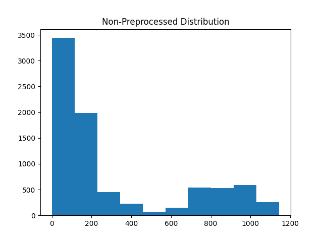
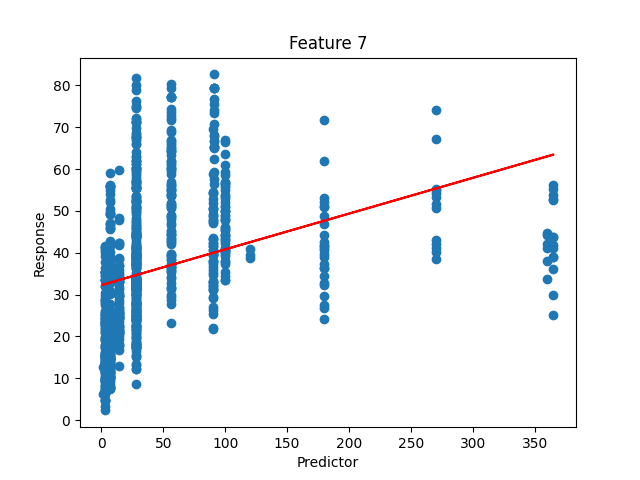

# CSE514 Programming Assignment 1 Report

> Name: Pingchuan Huang 				Student ID: 503954

## Introduction

### Description

The goal of this program is to predict the Concrete Compressive Strength from the usages of different type of ingredients. 

I am going form the prediction functions using 3 different regression methods, i.e., Uni-variate linear regression, Multi-variate linear regression, and Multi-variate polynomial regression. In the meantime, I developed way to pre-processing the data by standardizing each variable, and compare the speed and result of our program.

### Details of Algorithms

#### Whether used stochastic GD?

Stochastic Gradient Descent does help avoid local minimum, but I didn't use that.

#### Stop criterions

1. When the L2 Norm of the vector of the partial derivatives of parameters (m1, m2... mi, b) is below certain value, the regression stops. Basically, we want to stop the iteration if the gradient descent is too slow.
   - The stop value for the two linear regression models are `0.000001`.
   - For the quadratic model, the stop value is `0.001`. 
   - I've tested that if I use smaller value, the number of iterations will exceed the max steps, which is a million. 
2. When the number of steps exceeds certain value, the regression stops.
   - The stop value by default is `1000000`, since I want to make sure they will run enough rounds.

| Models                          | Max Steps | Min L2 Norm of Derivatives |
| ------------------------------- | --------- | -------------------------- |
| Univariate (Standardized)       | 1000000   | 0.000001                   |
| Univariate (Non-Standardized)   | 1000000   | 0.000001                   |
| Multivariate (Standardized)     | 1000000   | 0.000001                   |
| Multivariate (Non-Standardized) | 1000000   | 0.000001                   |
| Quadratic (Standardized)        | 1000000   | 0.001                      |
| Quadratic (Non-Standardized)    | 1000000   | 0.001                      |

#### Learning rate

I make it changing dynamically regarding the change of loss between each iteration using method `update_alpha`. When the loss goes up, I reduce the learning rate by `50%`, otherwise increase it by `1%`.

The initial value differs among each models and depends on whether Data Pre-Processing is applied. With Pre-Processing, I set it to somewhere between `0.000001` and `0.0000001`. The value also works for data without Pre-Processing, except for the last model, Multi-Variate Polynomial Regress, whose loss value explodes when the learning rate is too big (it goes too far in GD), so I have to set it to `0.0000000001`.

| Models                          | Learning rate |
| ------------------------------- | ------------- |
| Univariate (Standardized)       | 0.000001      |
| Univariate (Non-Standardized)   | 0.000001      |
| Multivariate (Standardized)     | 0.000001      |
| Multivariate (Non-Standardized) | 0.000001      |
| Quadratic (Standardized)        | 0.000001      |
| Quadratic (Non-Standardized)    | 0.0000000001  |

### Pseudo Code

#### Regression

1. The number of feature is **8**; the number of training sample is **900**.

2. `X` = Certain column (vector) or the entire matrix of training feature from the data sheet. Then, we transform it to **900 * 1** or **900 * 8** matrix depending on which model we are using.

3. `Y` = The last column of the data sheet, turn it into **900 * 1** matrix.

4. If this is the Multi-Variate Polynomial Regression, then, append to the right side of X the result of the element-wise multiplication of each feature vectors, which are the **36** quadratic terms.

5. Append a vector of ones to the right end of `X`, for the multiplication with the constant term. (Finally the `X` matrix is either **900 * 2** for model 1, or **900 * 9** for model 2, or **900 * 45** for the quadratic model).

6. `MB` = A **2 * 1**, or **9 * 1**, or **45 * 1** matrix depends on which model we are using, whose last value is the constant term, and the rest are for the linear and quadratic terms.

7. Initialize `LOSS`, `L2 Norm of Derivatives` to **infinity**, `STEPS` to **0**.

8. **WHILE** `L2 Norm of Derivatives` **>** `StopValue` **and** `STEPS` < `STOP_STEPS`:

   1. `DERIVATIVES` = Calculate the partial derivatives of each parameters in the matrix way. It is a **1** row horizontal matrix. 

      (Credit: https://vxy10.github.io/2016/06/25/lin-reg-matrix/) 

   2. Apply the learning rate to elements in `DERIVATIVES`. Do element-wise subtraction between `MB` and `DERIVATIVES.T` 

      That is, `MB` = `MB` - `DERIVATIVES.T ` *  `LEARNING_RATE`

   3. `STEPS` += 1

   4. `L2 Norm of Derivatives` = Calculate L2 Norm of `DERIVATIVES`

   5. `NEW LOSS` = Calculate the loss using updated parameters.

   6. Increase `LEARNING RATE` by **0.01** if `NEW LOSS` < `LOSS`, otherwise reduce it by half.

   7. `LOSS` = `NEW LOSS`

9. **RETURN** `MB`.

#### Additional steps if we do data pre-processing

I am using the **scaling (min-max normalization)** method.

After Step.5 in Regression:

1. `Scales` = [ ]
2. For each columns in `X`, except the last one:
   1. Find the `min` and `max` value in it.
   2. Update each value `v` by `v` = (`v` - `min`) / (`max` - `min`)
   3. Now the data distributed within **0** and **1**.
   4. Append `min` and `max` to `Scales` so that we can properly scale value in the test data set.
3. **Return** the new `X` and `Scales`

### (+2 bonus pts) Description of the Quadratic Model

See above.

### (+4 bonus pts) Description of Data Standardization

#### Method

I applied scaling (min-max normalization) to each row of features, to make them fit in between 0 and 1.

#### Histograms

The value of pre-processed data are more evenly distributed comparing to the un-preprocessed one.

## Results

### Variance explained of models on the training dataset

The training automatically stops when the L2 Norm of derivatives reaches the stop value. Although the result seems similar on both training on pre-processed and non-preprocess data, the iterations elapsed are significantly different. The iterations of training on pre-processed data are no more than 5000; for uni-variate models;  no more than 100000 for the multi-variate linear model; and no more than 600000 for the quadratic model. However, almost all training on non-preprocessed data exceeded the maximum iterations while the result was still inferior to those from pre-processed. So data pre-processing can at least fasten the training speed.

| Models                                    | Pre-Processed        | Non-Pre-Processed     |
| ----------------------------------------- | -------------------- | --------------------- |
| Uni-Variate Linear Regression - Feature.0 | 0.22825858392552245  | 0.2277804149950582    |
| Uni-Variate Linear Regression - Feature.1 | 0.017208971265118556 | 0.0172089712629645    |
| Uni-Variate Linear Regression - Feature.2 | 0.002035355116008719 | 0.0020353551148349913 |
| Uni-Variate Linear Regression - Feature.3 | 0.0870741625546625   | 0.03748129894822072   |
| Uni-Variate Linear Regression - Feature.4 | 0.17428080158691384  | 0.17428080158695125   |
| Uni-Variate Linear Regression - Feature.5 | 0.038466583708890334 | -0.0863160383151611   |
| Uni-Variate Linear Regression - Feature.6 | 0.03228636782791372  | -0.11561388393254313  |
| Uni-Variate Linear Regression - Feature.7 | 0.1113823961381637   | 0.11138239613721601   |
| Multi-Variate Linear Regression           | 0.6127199839036626   | 0.6127141689062416    |
| Multi-Variate Polynomial Regression       | 0.8079087791510478   | 0.7867129699118943    |

### Variance explained of models on the testing set

The result for uni-variate models are inconsistent, but for the multi-variate linear and polynomial models, the result is significantly better than uni-variate models.

| Models                                    | Pre-Processed         | Non-Pre-Processed    |
| ----------------------------------------- | --------------------- | -------------------- |
| Uni-Variate Linear Regression - Feature.0 | 0.4354355804392598    | 0.434876189970022    |
| Uni-Variate Linear Regression - Feature.1 | -0.11115955003290523  | -0.11115813448037226 |
| Uni-Variate Linear Regression - Feature.2 | -0.039987586834406175 | -0.03998781370598703 |
| Uni-Variate Linear Regression - Feature.3 | -0.07842408402413148  | -0.07278655900919406 |
| Uni-Variate Linear Regression - Feature.4 | -0.6374844347303614   | -0.637484762882583   |
| Uni-Variate Linear Regression - Feature.5 | -0.32388437251178415  | -0.15129306498166994 |
| Uni-Variate Linear Regression - Feature.6 | -0.1759077749792861   | -0.18328761221673173 |
| Uni-Variate Linear Regression - Feature.7 | -0.05013853815163971  | -0.05013783419568929 |
| Multi-Variate Linear Regression           | 0.5789460184844312    | 0.5775885231620859   |
| Multi-Variate Polynomial Regression       | 0.6749234729927985    | 0.6870487192510564   |

### Plots of trained Uni-Variate models (Data is Pre-Processed)

### (+4 bonus points) if you include results from your quadratic model.

See first two parts of **Results**.

### (+4 bonus points) if you include results from using normalized or standardized feature values as input

See first two parts of **Results**.

## Discussion

### Describe how the different models compared in performance on the training data. Did the same models that performed well on the training data do well on the testing data

1. The uni-variate models have pretty bad performance on training data, only slightly better than calculating the mean value of the true result.
2. The uni-variate models are unreliable in predicting the testing dataset even if they did well in training data.
3. The multi-variate models (both linear and polynomial) have significantly better performance on both training and testing data, as we can see from the result of calculation of variance explained for different models. These two models have values that are much closer to 1, while the polynomial one is much better (more than 0.8).
4. Both multi-variate models have consistent performance in predicting both training and testing datasets. However, the value explained for testing dataset is slightly worse than the result for training dataset.
4. Without data-preprocessing, however, uni-variate models may be even worse than calculating the average value of the true responses. This may caused by insufficient iterations of model training since they require more iterations based on my observation.

| Models                                    | R Square (Pre-Processed) | Iterations | R Square (Non-Pre-Processed) | Iterations |
| ----------------------------------------- | :----------------------- | ---------- | ---------------------------- | ---------- |
| Uni-Variate Linear Regression - Feature.0 | 0.22825858392552245      | 1530       | 0.2277804149950582           | 1000000    |
| Uni-Variate Linear Regression - Feature.1 | 0.017208971265118556     | 1481       | 0.0172089712629645           | 1000000    |
| Uni-Variate Linear Regression - Feature.2 | 0.002035355116008719     | 1445       | 0.0020353551148349913        | 1000000    |
| Uni-Variate Linear Regression - Feature.3 | 0.0870741625546625       | 1000000    | 0.03748129894822072          | 1000000    |
| Uni-Variate Linear Regression - Feature.4 | 0.17428080158691384      | 1000000    | 0.17428080158695125          | 1000000    |
| Uni-Variate Linear Regression - Feature.5 | 0.038466583708890334     | 1602       | -0.0863160383151611          | 1000000    |
| Uni-Variate Linear Regression - Feature.6 | 0.03228636782791372      | 1614       | -0.11561388393254313         | 1000000    |
| Uni-Variate Linear Regression - Feature.7 | 0.1113823961381637       | 1000000    | 0.11138239613721601          | 1000000    |
| Multi-Variate Linear Regression           | 0.6127199839036626       | 13838      | 0.6127141689062416           | 1000000    |
| Multi-Variate Polynomial Regression       | 0.8079087791510478       | 510753     | 0.7867129699118943           | 1000000    |

### Describe how the coefficients of the uni-variate models predicted or failed to predict the coefficients in the multi-variate model(s)

Note: I am using the coefficients from models trained from pre-processed data.

| Feature NO. | Coefficient of each Uni-Variate Linear model | Coefficients of Multi-Variate Linear model |
| ----------- | -------------------------------------------- | ------------------------------------------ |
| Feature 0   | 34.41549554                                  | 48.61112746                                |
| Feature 1   | 9.45514834                                   | 34.08097931                                |
| Feature 2   | -2.5087669                                   | 17.2405404                                 |
| Feature 3   | -29.22722009                                 | -22.00664687                               |
| Feature 4   | 37.47737023                                  | 10.03806901                                |
| Feature 5   | -15.37887138                                 | 4.57227349                                 |
| Feature 6   | -15.14577079                                 | 4.16281615                                 |
| Feature 7   | 31.11197486                                  | 41.99221665                                |

Based on the value and the chart, it is clearly that the coefficients from uni-variate models predicts those of multi-variate model. The bigger coefficients in uni-variate models tends to be also bigger in multi-variate model. Each feature is kind of sharing the similar importance in both models.

### Draw some conclusions about what factors predict concrete compressive strength. What would you recommend to make the hardest possible concrete?

Based on the observation of the coefficients of Multi-Variate Linear Model (the table and figure above), if we want the concrete compressive strength be higher, we would like to put more of those features(factors) with higher and positive coefficients into the concrete.

Based on the observation of the coefficients of Multi-Variate Polynomial Model (the table below, Note: I am using the coefficients from models trained from pre-processed data), which has much better variance explained, we would like to use more features(factors) or combinations that having higher and positive coefficients in the concrete.

Usages of features(factors) or combinations that having coefficients close to 0 are less likely to impact the strength of concrete.

We would want to avoid using too many features(factors) or combinations having significant negative coefficients.

| Feature NO. (Or Combination of Features) | Coefficients of Multi-Variate Polynomial Model (Descending) |
| ---------------------------------------- | ----------------------------------------------------------- |
| 3                                        | 211.851478480                                               |
| 0                                        | 197.399327790                                               |
| 26                                       | 115.218527760                                               |
| 25                                       | 97.153549190                                                |
| 55                                       | 85.363021730                                                |
| 56                                       | 84.213356410                                                |
| 67                                       | 79.972568550                                                |
| 05                                       | 62.369067670                                                |
| 16                                       | 60.749666560                                                |
| 6                                        | 52.753701350                                                |
| 15                                       | 50.151554880                                                |
| 34                                       | 43.816737730                                                |
| 17                                       | 37.888780000                                                |
| 22                                       | 37.607817080                                                |
| 02                                       | 36.643964390                                                |
| 07                                       | 36.258612970                                                |
| 12                                       | 35.807631640                                                |
| 7                                        | 31.832461640                                                |
| 4                                        | 21.470007780                                                |
| 45                                       | 21.304594470                                                |
| 01                                       | 15.011980260                                                |
| 11                                       | 13.198980400                                                |
| 27                                       | 12.541397510                                                |
| 47                                       | 9.231974300                                                 |
| 44                                       | -5.614389830                                                |
| 37                                       | -5.788901930                                                |
| 33                                       | -7.836047510                                                |
| 14                                       | -14.789089770                                               |
| 46                                       | -15.789359960                                               |
| 00                                       | -16.801119210                                               |
| 57                                       | -26.076445590                                               |
| 23                                       | -26.843424180                                               |
| 24                                       | -27.136023710                                               |
| 06                                       | -39.512876270                                               |
| 13                                       | -57.025922680                                               |
| 36                                       | -67.149415890                                               |
| 1                                        | -68.795554180                                               |
| 35                                       | -69.408419440                                               |
| 04                                       | -72.299290530                                               |
| 77                                       | -82.309432350                                               |
| 66                                       | -88.024438650                                               |
| 5                                        | -126.036367170                                              |
| 03                                       | -175.448358800                                              |
| 2                                        | -230.991769440                                              |

### (+2 bonus points) if you include comparisons to the results from normalized or standardized data.

See first part of **Discussion**

### (+2 bonus points) if you include comparisons to the results from your quadratic model.

See first part of **Discussion**
